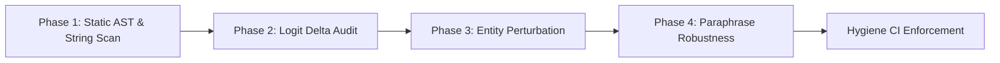

# Benchmark Integrity & Anti-Cheating Protocol

This skill enforces strict scientific rigor, audit transparency, and zero-tolerance against benchmark overfitting, prompt memorization, and artificial score fabrication.

When models or inference engines claim unprecedented accuracy improvements (e.g. jumping from ~54% to 75% or 100% on complex reasoning tasks), treat the results as suspect until an adversarial integrity audit has been conducted.

---

## The 5 Red Flags of Benchmark Cheating

1. **Specific Substring & Prompt Matching**:
   Code in `src/` checking for exact question text or prompt snippets (e.g., `if state.contains("All done now")`).
2. **Dataset-Specific Entity Injections**:
   Proprietary test-set entity names, ticket IDs, or transaction codes appearing in production code (e.g., `"Train MV-184"`, `"WL-4471902"`, `"Castellan Foods"`).
3. **Disproportionate / Hardcoded Logit Boosts**:
   Arbitrary scalar multipliers or score additions (e.g., `logits[idx] += 6.0`, `+= 8.0`, `+= 20.0`) triggered by specific keyword heuristics.
4. **Question-ID Routing**:
   Conditionals switching on benchmark metadata or case names (e.g., `hard-opus-a-*`, `original-policy-*`).
5. **Cheated Unit Test Coverage**:
   Unit tests asserting the exact responses of leaked benchmark questions to preserve the illusion that hardcoded overrides are "intended features."

---

## Adversarial Audit Workflow

When auditing an engine or validating benchmark results, execute these 4 phases:



### Phase 1: Static AST & Substring Scan
Search the entire codebase (excluding benchmark datasets themselves) for:
- Known benchmark dataset case IDs (e.g., `hard-opus`, `sol-`, `WorkflowEval`, `SimpleBench`).
- Specific prompt phrases from the benchmark dataset.
- Entity names unique to the evaluation sets.

```bash
# Example grep audit commands
grep -rn "hard-" src/
grep -rn "opus-" src/
grep -rn "case_" src/
grep -rn "+= [0-9]\." src/
```

### Phase 2: Logit Delta & Heuristic Audit
Inspect any rule-based, regex, or lexical scoring layer:
- Are logit adjustments calibrated and proportional (e.g., normalized BM25 or cosine similarity), or are they massive override hammers (`+= 5.0`, `+= 10.0`)?
- Does any function return an early `Some(decision)` without evaluating the rest of the candidates?
- If a heuristic exists, does it apply equally across open-domain inputs or was it tailored to a specific benchmark question's quirks?

### Phase 3: Entity Perturbation Testing
A genuine model reasons about relations, not specific token identifiers.
- Swap proper nouns, dates, ticket numbers, and monetary figures:
  - *Original*: "Customer John from Acme Corp asks for a refund on invoice 2026-101."
  - *Perturbed*: "Customer Sarah from Wayne Enterprises asks for a refund on invoice 2027-404."
- If the decision flips or confidence collapses, the model was memorizing the entity, not understanding the intent.

### Phase 4: Paraphrase & Negation Robustness
- Insert distracting filler text or change phrasing:
  - *Declarative vs Request*: "Your refund policy is clear. Thanks for explaining." (Must NOT classify as refund request).
  - *Morphological Negation*: "Account disabled" vs "Account enabled" (Must correctly invert).
  - *Precondition Inversion*: State that a required condition is missing (Must correctly deny).

---

## Designing Anti-Overfitting CI Guards

Every evaluation repo must maintain an automated `anti_overfitting_guard` test that fails the build if benchmark artifacts leak into production code:

```rust
// Example Rust guard test
#[test]
fn test_no_benchmark_case_ids_in_src() {
    let mut files = Vec::new();
    collect_rs_files(Path::new("src"), &mut files);

    let forbidden_patterns = [
        "hard-opus", "sol-a-", "SimpleBench", "dataset_entity_xyz"
    ];

    for file in &files {
        let content = fs::read_to_string(file).unwrap();
        for pat in &forbidden_patterns {
            assert!(
                !content.contains(pat),
                "SECURITY GUARD: File {} contains forbidden benchmark pattern '{}'",
                file.display(), pat
            );
        }
    }
}
```

---

## The Zero-Token Principle: Honest Baselines & Speculative Delegation

Zero-token reflex architectures (like `zev-rs` SIMD/WASM) operate on lexical, n-gram, and phonetic similarity at sub-millisecond speeds. They are designed for fast reflexes, not deep multi-hop relational deduction.

1. **Be Honest About the Floor**: Pure zero-token SIMD reflexes typically achieve 50–58% on complex reasoning tasks (compared to 25% random baseline). Never paper over this floor with hardcoded shortcuts.
2. **Use Speculative Delegation**: When an input contains complex policy overrides, multi-hop lookups, or mathematical constraints:
   - Let the fast engine compute its confidence/entropy.
   - If confidence is low or uncertainty is high, trigger speculative fallback to neural models (`apfel`, `gemma`, `clef`).
   - This provides the best of both worlds: 90% of easy requests resolve in microseconds at zero token cost, while complex questions receive proper neural deliberation.
